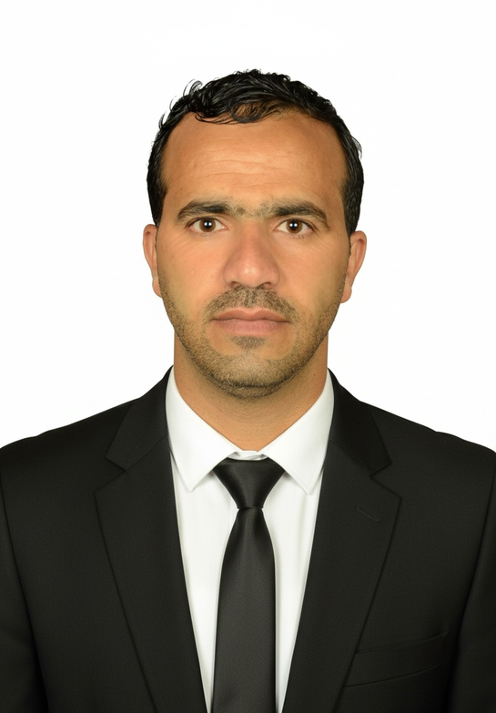

# Ibrahim Al-Harish - Professional Portfolio

A modern, responsive portfolio website for Ibrahim Ali Muqbil Al-Harish, showcasing his experience as a Resources Manager and Certified Trainer.

## 🌟 Features

- **Modern Design** - Clean and professional layout
- **Fully Responsive** - Works on all devices
- **Arabic RTL Support** - Proper right-to-left layout
- **Fast Loading** - Optimized for performance
- **Professional Sections**:
  - Hero with professional photo
  - About section with personal info
  - Work experience timeline
  - Certificates & training
  - Skills showcase
  - Education background
  - Contact information

## 🛠️ Built With

- HTML5
- CSS3 (with CSS Grid & Flexbox)
- JavaScript (ES6+)
- Font Awesome Icons

## 🚀 Live Demo

Deployed on Vercel: [[view my website]](https://ibrahim-alharish-portfolio-dl1s.vercel.app/))

## 📧 Contact

- **Name**: Ibrahim Ali Muqbil Al-Harish
- **Phone**: +967 771064541
- **Email**: ibrahim.alharish@email.com
- **Location**: Yemen - Sana'a

## 📄 License

This project is licensed under the MIT License.
